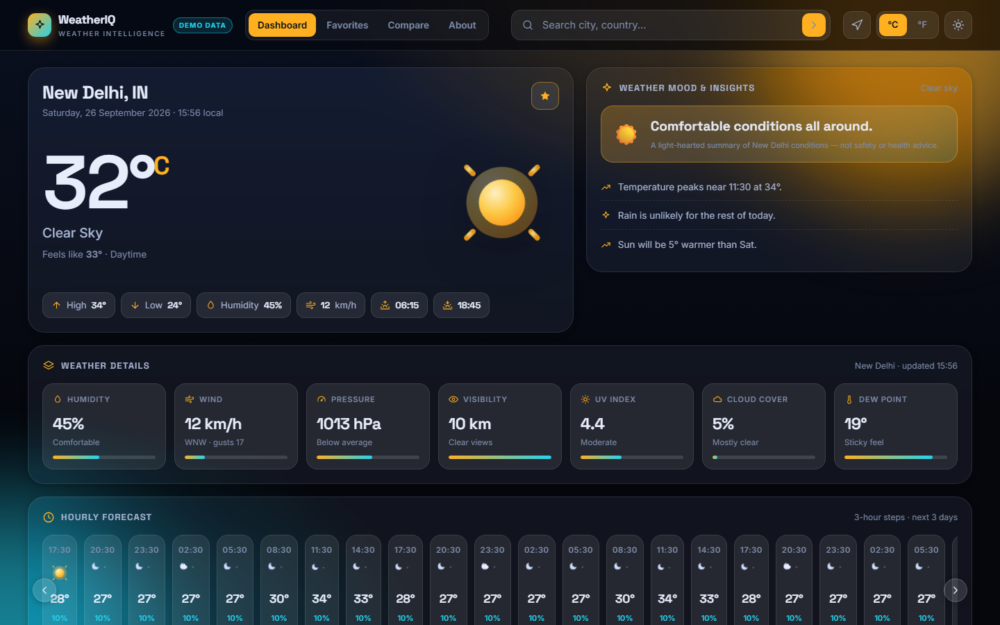
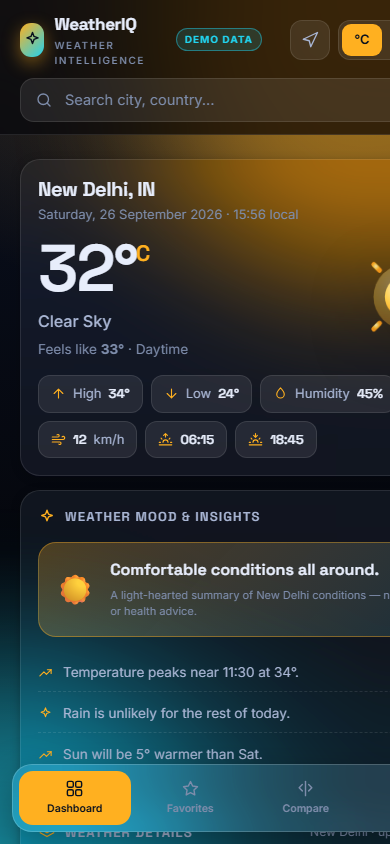
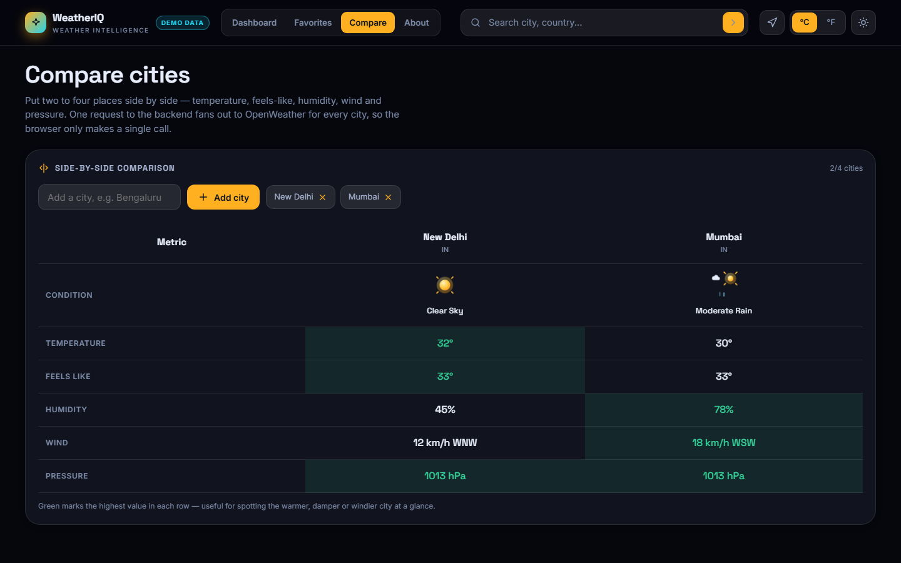
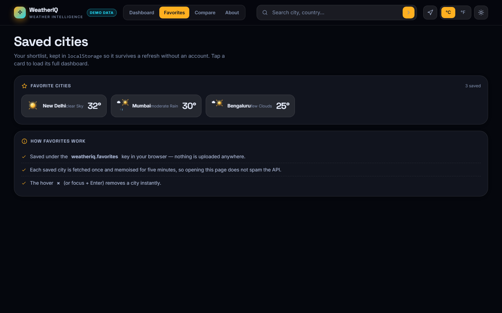
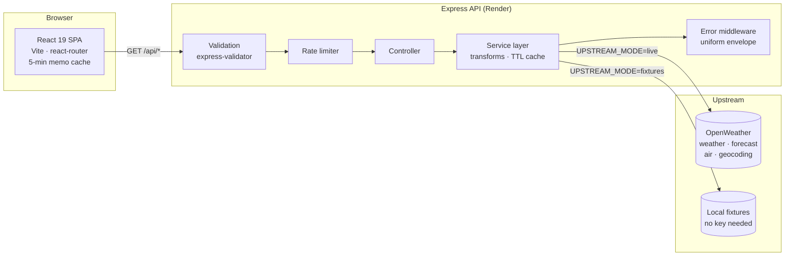

# WeatherIQ — Weather Intelligence Dashboard

A production-style full-stack weather dashboard: **React 19 + Vite** on the front, an **Express 5 API layer** on the back, OpenWeather as the data source. Search any city, use geolocation, track favourites, compare up to four cities side by side, and read air quality, UV, hourly trends and 5-day forecasts — with skeleton loaders, graceful error states, dark/light themes and weather-reactive backgrounds.



| Mobile | Compare | Favourites |
| --- | --- | --- |
|  |  |  |

---

## Highlights

**Frontend**
- Current conditions, 24×3-hour hourly rail, 5-day forecast, hand-built **SVG charts** (no chart library)
- Air quality index with pollutant breakdown, **UV index**, dew point, wind dial, sunrise/sunset arc
- Debounced **city autocomplete** (geocoding through our own API), recent searches, geolocation
- Favourites & compare persisted in `localStorage` — no accounts, nothing uploaded
- °C/°F toggle, dark/light themes, **weather-reactive backgrounds**, skeleton loaders, toasts
- Fully responsive (desktop grid → mobile bottom tab bar), `prefers-reduced-motion` respected
- Zero UI frameworks — every pixel of CSS is hand-written

**Backend (API layer — the browser never sees your API key)**
- Express 5, **input validation** (`express-validator`), **rate limiting** (`express-rate-limit`, draft-7 headers)
- **In-memory TTL cache** (weather/forecast 5 min, air 30 min, geocoding 60 min) + 8 s upstream timeout
- Response shaping: m/s → km/h, visibility → km, Magnus **dew-point**, solar-elevation **UV estimate**, 3-hour slots aggregated into calendar days
- Uniform error envelope `{ success:false, code, message }` mapped from OpenWeather failures
- Three upstreams behind one interface: `live` (real OpenWeather), `fixtures` (no-key demo data), `mock` (frontend-only)
- `GET /api/health` reports mode for health checks and the honest **“Demo data”** badge

## Architecture



```
wheather/
├── api/                        # Vercel Function entries → mount the Express app
│   ├── [...slug].js            # every single-segment /api/* route
│   └── weather/ forecast/      # the two multi-segment coordinate routes
├── client/                     # React 19 + Vite SPA
│   ├── src/
│   │   ├── components/         # 18 components (charts, cards, search, …)
│   │   ├── pages/              # Home · Favorites · Compare · About
│   │   ├── hooks/              # useWeather · useGeolocation · useDebounce · useLocalStorage
│   │   ├── services/           # weatherApi.js (fetch + cache) · mockData.js
│   │   ├── styles/             # variables · base · components · animations · responsive
│   │   └── utils/              # weatherUtils · constants
│   ├── vercel.json             # SPA rewrite (client-only deploys)
│   └── vite.config.js          # /api → :5000 in dev
├── server/                     # Express 5 API
│   ├── config/env.js           # single place for process.env
│   ├── utils/apiClient.js      # fetch + timeout + OpenWeather error mapping
│   ├── services/weatherService.js  # transforms · UV · dew point · cache
│   ├── controllers/ routes/ middleware/
│   ├── fixtures/               # OpenWeather-shaped local data (demo mode)
│   ├── scripts/                # selftest.mjs · smoketest.mjs
│   ├── server.js               # exports the app (listens only when run directly)
│   └── vercel.js               # serverless handler (path normaliser → app)
├── docs/screenshots/
├── vercel.json                 # one-project deploy: build client, SPA rewrite, /api excluded
├── render.yaml                 # optional: API on Render instead
├── DEPLOYMENT.md               # step-by-step deploy guide
└── README.md
```

## Tech stack

| Layer | Choice | Why |
| --- | --- | --- |
| UI | React 19, react-router 7 | hooks-first, code-split routes |
| Build | Vite 8, oxlint | instant dev server, zero-config lint |
| API | Express 5 | async error handling built in |
| Safety | express-validator, express-rate-limit | validation + abuse protection |
| Data | OpenWeather (weather/forecast/air/geo) | one key covers every endpoint |
| Charts | hand-rolled SVG | no 100 kB chart dependency |
| Deploy | Vercel (client + API) | one project, same-origin `/api` |

## Quick start

**Requirements:** Node.js ≥ 20

```bash
git clone <your-repo-url> && cd wheather

# API  (terminal 1)
cd server
npm install
cp .env.example .env        # then edit — see below
npm run dev                 # http://localhost:5000

# client  (terminal 2)
cd client
npm install
npm run dev                 # http://localhost:5173  (proxies /api)
```

Open **http://localhost:5173**. Out of the box it runs in **fixtures mode** (`server/.env` → `UPSTREAM_MODE=fixtures`): the whole real stack is live, just without the third-party call, and the header shows a *Demo data* badge.

### Environment variables

**`server/.env`**

| Variable | Default | Notes |
| --- | --- | --- |
| `PORT` | `5000` | Render injects its own |
| `OPENWEATHER_API_KEY` | — | free key from <https://openweathermap.org/api> |
| `UPSTREAM_MODE` | `live` | `fixtures` = works without a key |
| `CLIENT_URL` | `http://localhost:5173` | CORS origins, comma-separated exact origins |
| `RATE_LIMIT_WINDOW_MS` | `900000` | 15 min |
| `RATE_LIMIT_MAX` | `300` | per IP per window |
| `UPSTREAM_TIMEOUT_MS` | `8000` | fetch timeout for OpenWeather |

**`client/.env`**

| Variable | Default | Notes |
| --- | --- | --- |
| `VITE_API_URL` | *(empty → same-origin `/api`)* | leave empty when client + API share one origin |
| `VITE_USE_MOCK` | `true` | frontend-only mock data (no server needed) |

### Scripts

| Where | Command | What |
| --- | --- | --- |
| `client` | `npm run dev` | Vite dev server with `/api` proxy |
| `client` | `npm run lint` / `npm run build` | oxlint · 92 kB gzip initial + lazy per-route chunks |
| `server` | `npm run dev` | `node --watch` API |
| `server` | `npm test` | 6 unit assertions (UV, dew point, transformers) |
| `server` | `npm run smoke` | 12 end-to-end API checks (`SMOKE_BASE=<url>` for deployed) |

## API reference

Base URL: `http://localhost:5000` · all responses wrapped: success → `{ "success": true, "data": … }`, failure → `{ "success": false, "code": "…", "message": "…" }`.

| Endpoint | Params | Returns |
| --- | --- | --- |
| `GET /api/health` | — | `{ status, uptime, upstream, apiKey }` |
| `GET /api/weather` | `city` (2–80) | current conditions for a city |
| `GET /api/weather/coordinates` | `lat` (−90…90), `lon` (−180…180) | current conditions by coordinates |
| `GET /api/forecast` | `city` | 24 hourly slots + 5–7 daily rows |
| `GET /api/forecast/coordinates` | `lat`, `lon` | same, by coordinates |
| `GET /api/air-quality` | `lat`, `lon` | AQI 1–5, pollutants, estimated UV |
| `GET /api/geo` | `q` (2–80) | up to 6 `{ name, country, state, lat, lon }` suggestions |
| `GET /api/compare` | `cities=Delhi,Mumbai,…` (2–4) | array of weather payloads, one request |

```bash
curl "http://localhost:5000/api/weather?city=Delhi"
```

```json
{
  "success": true,
  "data": {
    "city": { "name": "New Delhi", "country": "IN", "lat": 28.61, "lon": 77.21, "timezoneOffset": 19800 },
    "epoch": 1790414564,
    "condition": { "id": 800, "main": "Clear", "description": "clear sky", "icon": "01d" },
    "current": {
      "temp": 33.1, "feelsLike": 34.1, "humidity": 45, "pressure": 1013,
      "visibility": 10, "windSpeed": 11.9, "windDeg": 290, "windGust": 16.9,
      "clouds": 5, "dewPoint": 19.5, "uvi": 6.4
    },
    "temps": { "min": 24, "max": 34 },
    "sun": { "sunrise": 1790383500, "sunset": 1790428500 },
    "isDay": true
  }
}
```

**Error codes** — `validation` (400) · `notfound` (404) · `limit` (429) · `config` (503, no key) · `network` (502/504) · `upstream` (502)

**Limits & caching** — 300 requests / 15 min / IP · server caches upstream responses (weather 5 min, forecast 5 min, air 30 min, geo 60 min) · client memoises responses for 5 minutes.

## Data notes (honesty section)

- **Units** — OpenWeather *metric* everywhere; wind m/s → km/h, visibility m → km. °F is a client-side display conversion.
- **Dew point** — computed with the Magnus formula (not provided by the current-weather endpoint).
- **UV index** — the free air-pollution endpoint has no UV field, so the server *estimates* it from solar elevation + cloud cover and labels it as such in the UI.
- **Fixtures vs live** — fixtures are OpenWeather-*shaped* local payloads so the full pipeline runs without a key; the 10 registry cities carry curated numbers, and any other search returns a deterministic demo city derived from the name (same search → same weather). The badge and `/api/health` always tell you which mode is active. No mode silently pretends to be another.

## Testing

```bash
cd server
npm test            # unit: UV model, dew point, solar elevation, both transformers
npm run dev &       # then:
npm run smoke       # e2e: 12 checks — shapes, validation, 404s, cache hits
SMOKE_BASE=https://<deployed-api> npm run smoke   # same suite against production
```

Client changes are verified with `npm run lint` + `npm run build`, plus headless-browser passes over all four routes (documented in `DEPLOYMENT.md`).

## Deployment

One Vercel project serves the client and the Express API from a single origin — see **[DEPLOYMENT.md](DEPLOYMENT.md)** for the details:

- Root `vercel.json` builds `client/` and rewrites non-`/api` paths to `index.html`
- `api/*.js` mounts the Express app as Vercel Functions (`server/vercel.js` is the handler)
- Runs in **fixtures** mode out of the box; set `OPENWEATHER_API_KEY` + `UPSTREAM_MODE=live` in the project environment and redeploy for real data, then re-run the smoke suite

## Accessibility & performance

- Semantic landmarks, ARIA labels on every icon button, keyboard-navigable search (`↑ ↓ Enter Esc`), visible focus styles
- Skeletons instead of spinners, `aria-live` regions for state changes, `role="alert"` errors with retry
- `prefers-reduced-motion` disables non-essential animation
- Route-level code splitting, memoised API responses, no layout thrash (single CSS bundle ~7 kB gzip)
